# 🧑‍💼 Agentic HR Manager

## Table of Contents

- [Use case description](#use-case-description)
- [Talent acquisition agent](#-talent-acquisition-agent)
- [Automate talent acquisition agent using agentic workflows](#-automate-talent-acquisition-agent-using-agentic-workflows)
- [HR case review agent](#-hr-case-review-agent)
    
## Use Case Description

This is the story of **Luisa**. **Luisa** is an HR manager for a large corporation that's hiring 5,000 employees for their new division. Her struggle is two-fold:

1. **Recruiting candidates** for their open positions
2. **Handling reports** from employees for potential Business Conduct Guidelines violations.

For recruiting, Luisa gets many PDFs with candidate résumés. She has to:

- Check if candidates **fulfill the requirements** of a given position
- Fill in a **table** with the skills/experience of each candidate
- Select **candidates** to be interviewed
- Assign **interviewers** from the team
- Coordinate **interviews** with candidates and interviewers via email
- Schedule **interviews**
- Compile **feedback** from different reviewers
- **Report back** the results to the hiring manager

Luisa would like to make her hiring process more efficiently.

## 🥇 Talent acquisition agent

This first agent will help with the recruiting process. Follow these steps to build your Talent Acquisition AI Agent:

1. Open watsonx Orchestrate. You will see the screen below. Then, click on **Create an Agent** at the bottom left and select **Create from scratch**.

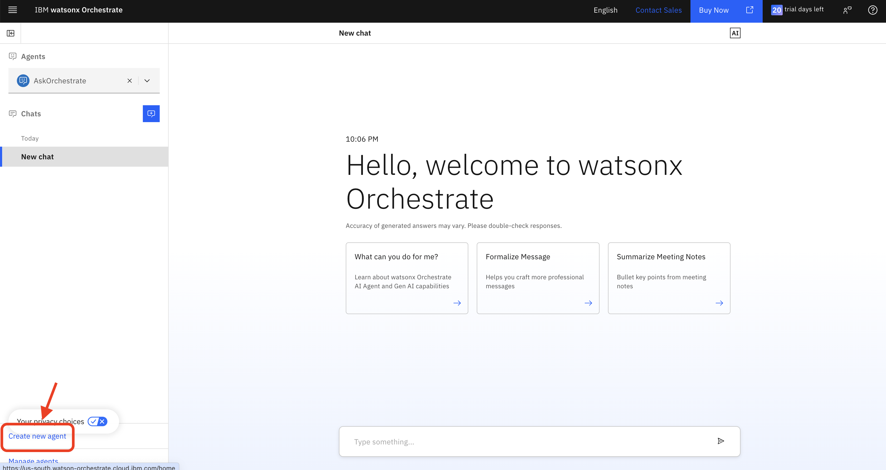
<br>
<br>

2. Give it a name and a description. Descriptions are used to route a given query to this agent when needed. You can use the description below or experiment with your own:
```
This agent helps figure out whether a set of candidates match the skills given in a job description
```

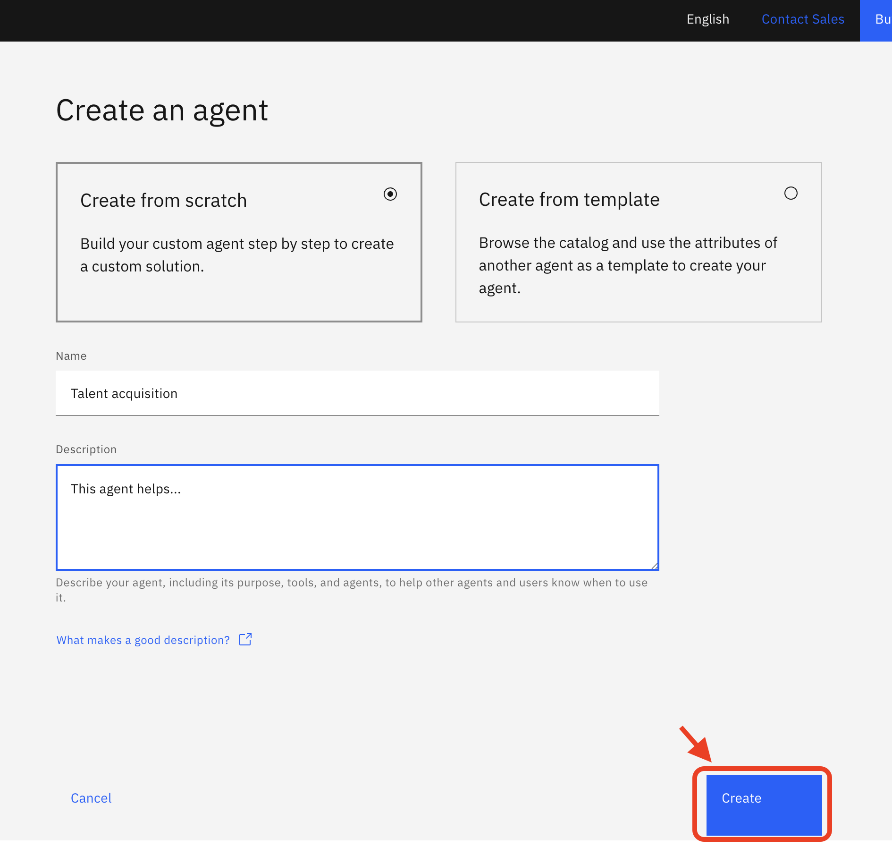
<br>
<br>

3. After clicking **Create**, you will be taken to this screen. Notice that by default the model should be set to **GPT-OSS 120B**. If not, use the dropdown menu to select it.
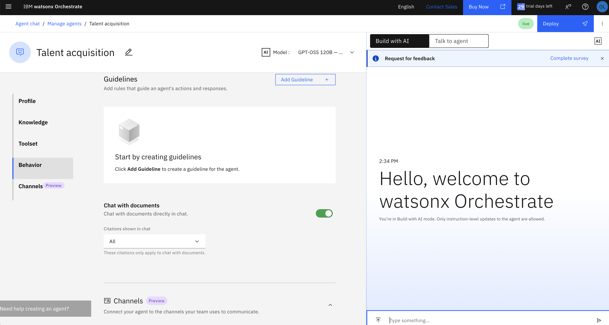
<br>
<br>

4. Scroll down and enable the **Chat with Documents** toggle:

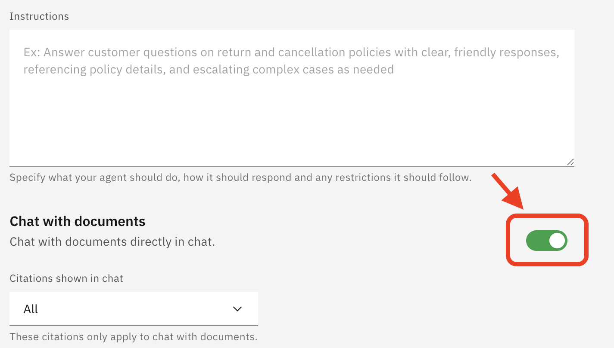
<br>
<br>

5. Now let's deploy the agent by clicking on the blue **Deploy** button. This is how easily you can deploy an agent in watsonx Orchestrate.


<br>
<br>


6. Now let's simmulate what the HR manager would do to automatically process résumés. First, download the résumés and job description files below. Once you have them in your local machine, upload them all at once by clicking on the **Upload** button below the chat. You can also drag and drop the files on the chat as an alternative.


- [Candidate 1's Résumé](../data/Candidate%201.pdf)
- [Candidate 2's Résumé](../data/Candidate%202.pdf)
- [Candidate 3's Résumé](../data/Candidate%203.pdf)
- [Candidate 4's Résumé](../data/Candidate%204.pdf)
- [Candidate 5's Résumé](../data/Candidate%205.pdf)
- [Job Description](../data/Job%20Description.pdf)

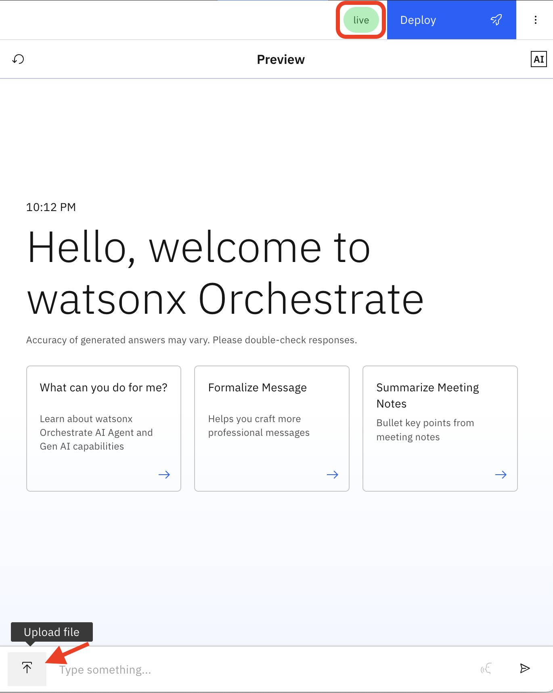
<br>
<br>


7. You will see a confirmation of the files being uploaded as follows:


<br>
<br>

8. Now let's try a few different prompts to process the résumés and match them with the job description. First, let's summarize the skills and requirements in the job description:

```
Above, I have uploaded 5 documents with candidate resumes and one document with job description. Can you give me a short one-paragraph summary of the job description?
```

9. Now let's check that the résumés were uploaded correctly by querying the names of the candidates:

```
give me the names of all the candidates
```

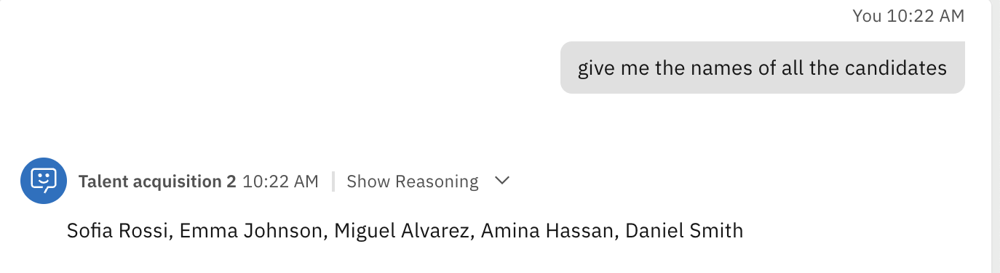
<br>
<br>


10. Now let's generate a table matching the required skills with each candidate:
```
make a table where each row is a candidate and each column is a skill in the job description. Have the check emoji if the candidate does have the corresponding skill.
```


<br>
<br>

You can see that Emma is the person which has the best match of skills. However, the HR manager still needs to go and review Emma's profile and résumé before proceeding. It is important to keep a human in the loop, especially when making decisions affecting people. The goal of Agentic AI is to automate the tedious tasks rather than replacing the job of the HR manager.

<!--11. Now let's ask for drafting an email to schedule an interview:
```
Draft an email asking Emma for three potential times for next week to interview.
```


-->

11. Now let's work on scheduling the interviews. First, let's add interviewers data. In real life, this will come from a database or data lakehouse querying multiple systems in the organization. For simplicity, let's assume we have a PDF file with the availability of interviewers and their skills. We can use watsonx Orchestrate to add interviewers **Knowledge** to the agent. Scroll down to the **Knowledge** section and click on **Choose Knowledge**:

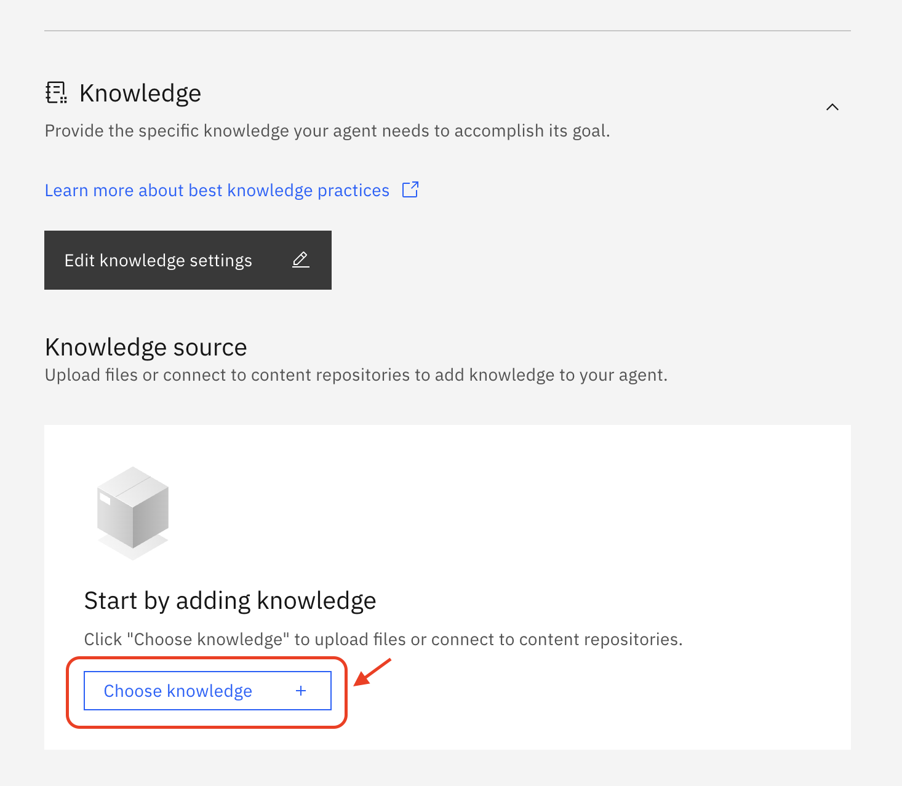.
<br>
<br>


12. Select **Upload Files** at the bottom, click **Next**:

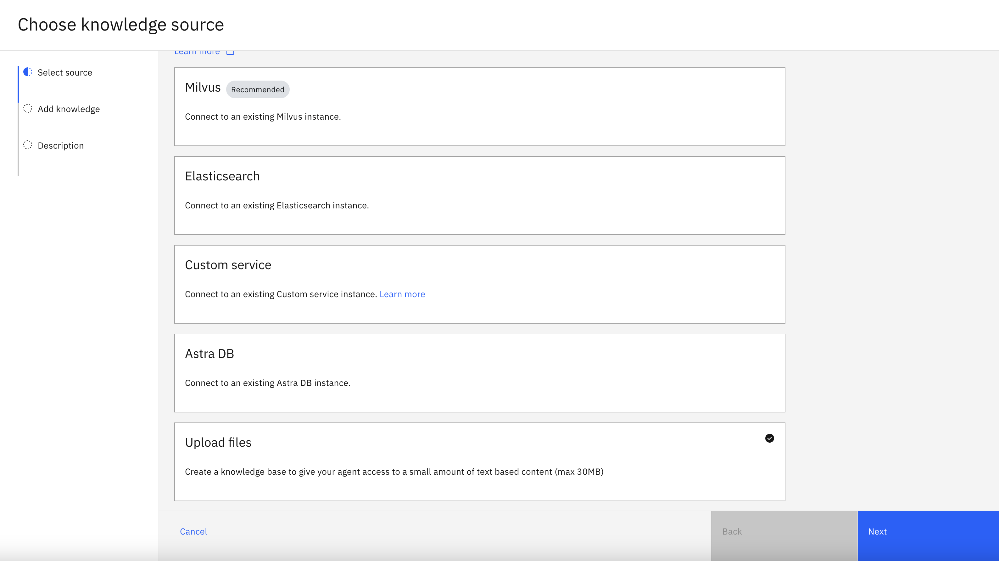
<br>
<br>

13. Drag and Drop or upload the file [Interviewer availability dataset](../data/Interviewer%20availability.docx). Click **Next**:

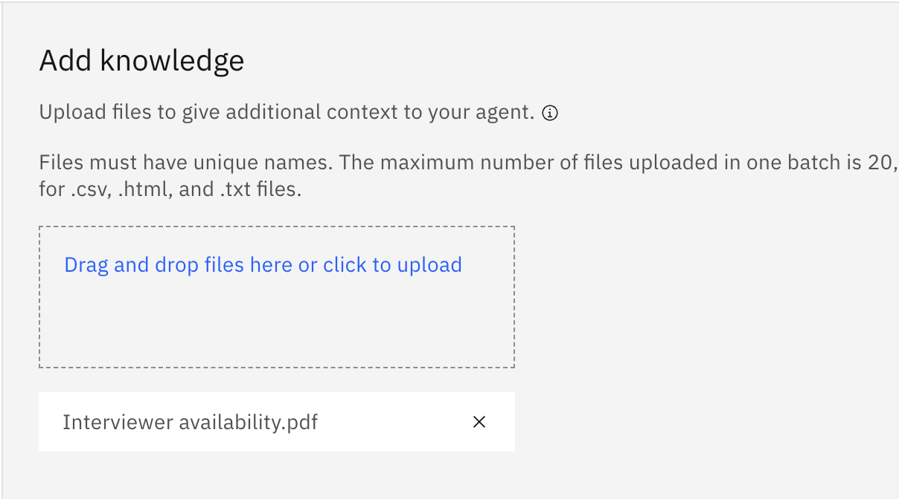
<br>
<br>

Now you need to set a description. This will be used to determine when to invoke the knowledge in the file. Add the following under **Description** and click **Save**:

```
This document has the availability and skills of different interviewers
```

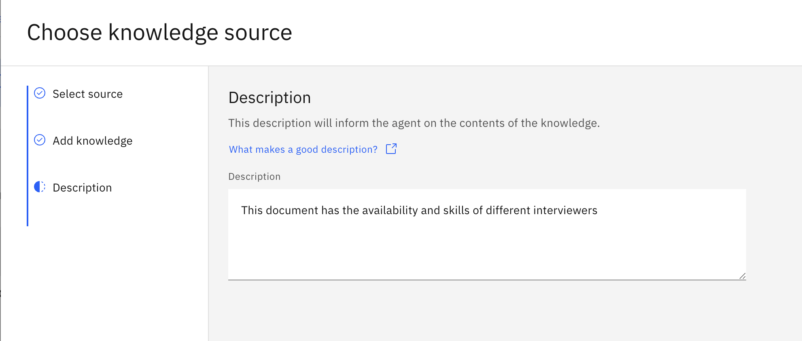
<br>
<br>


14. Now let's run some additional queries for the interviews. First, let's check if the interviewer data was loaded properly:

```
show me the availability of interviewers
```


<br>
<br>

15. Now let's help Luisa select the most adequate interviewers for the given job description:

```
who's the most proficient interviewer for the job description? Show me the skills they have
```
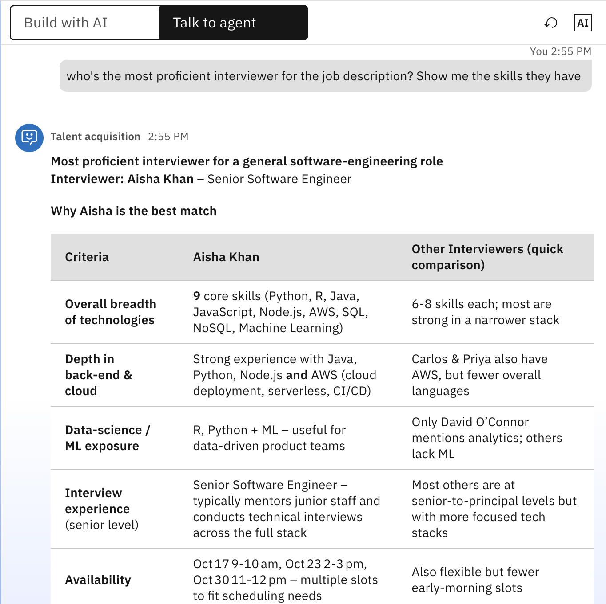


16. Finally, let's pick an interviewer and draft an email to one of the candidates with the interviewers' availability:
 
```
draft an email to Emma to invite her for an interview with Aisha. Use Aisha's availability in the email draft
```

<br>
<br>

## 🤖 Automate talent acquisition agent using agentic workflows

Thus far, you built an agent leveraging the **Chat with documents** feature of watsonx Orchestrate to upload process résumés, job descriiptions and interviewer schedules. In this case the agent's LLM does all the heavy lifting while it is Luisa's role to provide the right prompt/query.  

However, it is often not obvious what the right prompt should be, especially for an HR Manager without prompt engineering background. Furthermore, there might be additional steps involved, such as automatically reaching out to the selected candidate or automatically scheduling interviews. In this case we could leverage **Agentic Workflows**. 

The next part of the lab is more advanced and requires some low-coding skills and familiarity with basic programming concepts such as variables and for each loops. If you would like to learn how to work with **Agentic Workflows** [follow these steps](./hands-on-lab-hr-manager-flows.md)

**🎉🎉 Congratulations!! You have completed the talent acquisition module. You're ready to go to the next one!**

## 🧑‍💼📝 HR case review agent

1. Create another agent as you did earlier. This time, add the following to the description:
```
This agent reviews HR cases from employee complaints of potential business conduct guidelines violations
```


<br>
<br>

2. Add knowledge to it. Scroll down for the **Knowledge** section and click on **Choose Knowledge**


<br>
<br>

3. Now you will upload the [IBM Business Conduct Guideliness Document](../data/ibm_business_conduct_guidelines.pdf). You can also experiment with your company's BCG if available. Enter a description. It could be something like this:

```
This is the IBM Business Conduct Guideliness
```

After saving, will see something like this:


<br>
<br>

4. You're now ready to test some queries:

```
Help me understand if the following complaint from an employee infringes the IBM Business Conduct Guidelines: "my manager raised his voice and called me names and made fun of me and told me really nasty things every day for the past month"
```


<br>
<br>

```
How about this one: my manager gave me a chocolate from Hawaii after her trip to Maui. Is this a BCG violation?
```


<br>
<br>

5. You can notice how the above might not be, in practice, a real violation to the Business Conduct Guidelines. We can tweak the agent to address certain situations differently. For that we can use the **Guidelines** feature. Scroll down to the **Guideliness** section and click on **New Guideline**:


<br>
<br>

6. Save it and try the same query one more time in the chat. You should see something like this:


<br>
<br>

7. The result after retrying the same query would look like this:


<br>
<br>

## 🛠️ Let's put it all together

We have seen how you can create two separate agents to address different business needs, namely (1) Talent Acquisition and (2) HR Case Reviews. But wouldn't it be cool to have a single interface to address both kinds of queries from the user? To do som let's create an HR Manager Agent able to route queries accordingly.

1. Create a new agent. Use the same procedure above. In the description, provide some basic routing directions such as:

```
This agent manages different HR requests:

1. Talent acquisition: processing resumes, job descriptions, ad interviewers, routing to the talent acquisition agent

2. HR Case Reviewer: processing HR complaints or cases submitted by employees as potential violations to the Business Conduct Guideliness
```

2. Scroll down to the Agents section.
3. Select Add from Local Instance
4. Search for the two agents you just created and add them both.
5. Now try different queries on the HR Manager Agent


