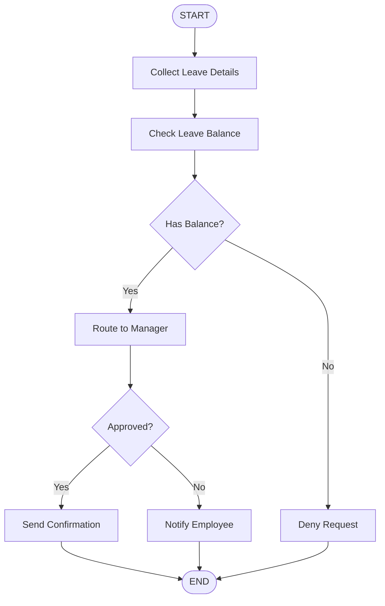

# Lab 2: Build Agentic Flows in the UI for HR Agent

## 📋 Overview

**Duration:** ~60 minutes  
**Level:** Beginner to Intermediate  
**Prerequisites:** Completion of Lab 1 (HR Agent creation)

In this lab, you'll extend your HR Manager agent with agentic workflows (flows). You'll learn to create multi-step processes that orchestrate tools, LLMs, and business logic to handle complex HR scenarios.

---

## 🎯 Learning Objectives

By the end of this lab, you will be able to:

1. Understand the concept of agentic flows
2. Create flows using the watsonx Orchestrate UI
3. Use different flow nodes (tools, LLM, conditions, user activities)
4. Connect flows to your HR agent
5. Implement multi-step HR workflows
6. Test and debug flows
7. Handle user inputs and approvals

---

## 🔗 Original Lab Materials

This lab is based on the **IBM Agentic AI Client Bootcamp - HR Talent Flows**.

### 📚 Accessing the Lab

**Original Source:** IBM Agentic AI Client Bootcamp  
**Repository:** github.ibm.com/skol/agentic-ai-client-bootcamp  
**Use Case:** HR Talent Management - Flows  
**Lab File:** `usecases/hr-talent/assets/hands-on-lab-hr-manager-flows.md`

**To access the original lab materials:**

1. **If you have IBM GitHub access:**
   ```bash
   git clone git@github.ibm.com:skol/agentic-ai-client-bootcamp.git
   cd agentic-ai-client-bootcamp/usecases/hr-talent/assets
   # Open hands-on-lab-hr-manager-flows.md
   ```

2. **If you don't have access:**
   - Contact your IBM representative or bootcamp coordinator
   - Request access to the Agentic AI Client Bootcamp materials
   - Alternative: Follow the general guidance below

---

## 🚀 Lab Overview (General Guidance)

### What You'll Create

**HR Agentic Workflows** that can:
- Process leave requests with approval workflows
- Handle benefits enrollment multi-step processes
- Automate document processing (e.g., expense reports, forms)
- Implement conditional logic based on employee data
- Collect structured information from users

### Example Workflows

1. **Leave Request Flow**
   - Collect leave details from employee
   - Check leave balance
   - Route to appropriate approver
   - Send confirmation

2. **Benefits Enrollment Flow**
   - Guide employee through options
   - Collect selections
   - Validate eligibility
   - Submit enrollment

3. **Document Processing Flow**
   - Accept document upload
   - Extract information
   - Validate data
   - Route for approval

---

## 🛠️ Prerequisites

Before starting this lab, ensure you have:

### 1. Completed Lab 1
- ✅ HR Manager agent created and tested
- ✅ Familiar with watsonx Orchestrate UI
- ✅ Understanding of agent basics

### 2. watsonx Orchestrate Access
- ✅ Flow creation permissions
- ✅ Access to flow builder UI
- ✅ Ability to test flows

### 3. Optional Components
- Document processing capabilities (for document flows)
- External system connections (for integration flows)
- Approval routing setup

---

## 📖 General Steps (High-Level)

### Step 1: Access Flow Builder
1. Log in to watsonx Orchestrate
2. Navigate to Flows section
3. Click "Create New Flow"

### Step 2: Design Your Flow
1. **Define flow purpose:** What problem does it solve?
2. **Map the process:** Identify all steps
3. **Identify inputs:** What information is needed?
4. **Define outputs:** What should the flow return?

### Step 3: Build Flow Nodes

#### Common Node Types

**1. Start Node**
- Entry point for the flow
- Defines input parameters

**2. Tool Nodes**
- Call Python tools or functions
- Integrate with external systems
- Process data

**3. LLM Nodes**
- Generate text responses
- Analyze information
- Make decisions

**4. User Activity Nodes**
- Collect user input
- Display forms
- Request approvals

**5. Condition Nodes**
- Implement if/else logic
- Route based on data
- Handle different scenarios

**6. End Node**
- Exit point for the flow
- Returns results

### Step 4: Connect Nodes
1. Drag and drop nodes onto canvas
2. Connect nodes in sequence
3. Map data between nodes
4. Configure node parameters

### Step 5: Test Your Flow
1. Use flow tester
2. Provide sample inputs
3. Verify each step executes correctly
4. Check output format

### Step 6: Connect to Agent
1. Save and publish flow
2. Add flow as tool to HR agent
3. Update agent instructions to use flow
4. Test end-to-end

---

## 💡 Flow Design Patterns

### Pattern 1: Linear Workflow
```
START → Collect Info → Process → Validate → END
```
**Use Case:** Simple data collection and processing

### Pattern 2: Conditional Workflow
```
START → Check Condition → [If True] → Action A → END
                       → [If False] → Action B → END
```
**Use Case:** Different paths based on criteria

### Pattern 3: Approval Workflow
```
START → Submit Request → Route to Approver → 
        Wait for Approval → [Approved] → Process → END
                         → [Rejected] → Notify → END
```
**Use Case:** Requests requiring approval

### Pattern 4: Document Processing
```
START → Upload Document → Extract Data → 
        Validate → [Valid] → Process → END
                → [Invalid] → Request Correction → END
```
**Use Case:** Form or document processing

---

## 🎨 Example Flow: Leave Request

### Flow Structure



### Node Configuration

**1. Collect Leave Details (User Activity)**
```yaml
Node Type: User Activity
Fields:
  - Leave Type: dropdown (Vacation, Sick, Personal)
  - Start Date: date picker
  - End Date: date picker
  - Reason: text area
```

**2. Check Leave Balance (Tool)**
```yaml
Node Type: Tool
Tool: check_leave_balance
Input: employee_id, leave_type
Output: available_days, requested_days
```

**3. Has Balance? (Condition)**
```yaml
Node Type: Condition
Expression: available_days >= requested_days
True Path: Route to Manager
False Path: Deny Request
```

**4. Route to Manager (Tool)**
```yaml
Node Type: Tool
Tool: send_approval_request
Input: manager_id, leave_details
Output: approval_status
```

---

## 🔍 Common Flow Scenarios

### Scenario 1: Benefits Enrollment
**Steps:**
1. Display available benefits
2. Collect employee selections
3. Calculate costs
4. Confirm choices
5. Submit enrollment

### Scenario 2: Expense Report
**Steps:**
1. Upload receipt/document
2. Extract expense details
3. Validate against policy
4. Route for approval
5. Process reimbursement

### Scenario 3: Onboarding Workflow
**Steps:**
1. Collect new hire information
2. Create accounts
3. Assign equipment
4. Schedule training
5. Send welcome package

### Scenario 4: Performance Review
**Steps:**
1. Collect self-assessment
2. Gather peer feedback
3. Manager review
4. Generate report
5. Schedule discussion

---

## 🐛 Troubleshooting

### Flow Not Executing
- **Check Connections:** Ensure all nodes are properly connected
- **Verify Inputs:** Confirm required inputs are provided
- **Test Individually:** Test each node separately
- **Review Logs:** Check execution logs for errors

### Data Not Passing Between Nodes
- **Check Mappings:** Verify data mapping configuration
- **Output Format:** Ensure output matches expected input
- **Variable Names:** Check variable naming consistency
- **Type Matching:** Verify data types match

### Condition Not Working
- **Expression Syntax:** Check condition expression syntax
- **Data Availability:** Ensure data exists before condition
- **Type Comparison:** Verify comparing compatible types
- **Test Values:** Use known values to test logic

### User Activity Issues
- **Form Fields:** Verify all required fields are defined
- **Validation:** Check field validation rules
- **Display:** Test form rendering
- **Submission:** Verify form submission handling

---

## ✅ Lab Completion Checklist

- [ ] Accessed flow builder UI
- [ ] Created at least one HR workflow
- [ ] Used multiple node types (tool, LLM, condition, user activity)
- [ ] Implemented conditional logic
- [ ] Tested flow with sample data
- [ ] Connected flow to HR agent
- [ ] Updated agent instructions
- [ ] Tested end-to-end workflow
- [ ] Documented flow design

---

## 🎓 What's Next?

After completing this lab, you're ready to transition to programmatic development:

**[Lab 3: Use Bob to Build a Custom Agent](../lab-3-bob-custom-agent/)**

In Lab 3, you'll learn to:
- Use Bob for code generation
- Create agents programmatically
- Work with the watsonx Orchestrate ADK
- Version control your agents

---

## 📚 Additional Resources

### watsonx Orchestrate Documentation
- [Flow Builder Guide](https://www.ibm.com/docs/en/watsonx/watson-orchestrate)
- [Flow Node Reference](https://www.ibm.com/docs/en/watsonx/watson-orchestrate)
- [Best Practices for Flows](https://www.ibm.com/docs/en/watsonx/watson-orchestrate)

### Flow Design Resources
- Workflow design patterns
- Business process modeling
- User experience in flows
- Error handling strategies

---

## 🤝 Credits

**Original Lab Author:** IBM Skills Academy Team  
**Source:** IBM Agentic AI Client Bootcamp  
**Repository:** github.ibm.com/skol/agentic-ai-client-bootcamp  
**Use Case:** HR Talent Management - Flows

This guide provides general guidance for the lab. For detailed step-by-step instructions with screenshots, please access the original lab materials from the IBM Agentic AI Client Bootcamp.

---

## 📧 Support

**For Lab Access:**
- Contact your IBM representative
- Request bootcamp materials access
- Join the IBM Skills Academy program

**For Technical Issues:**
- Check watsonx Orchestrate documentation
- Contact watsonx support
- Review the [main README](../README.md)

---

**Ready to build powerful workflows? Let's create some flows! 🚀**