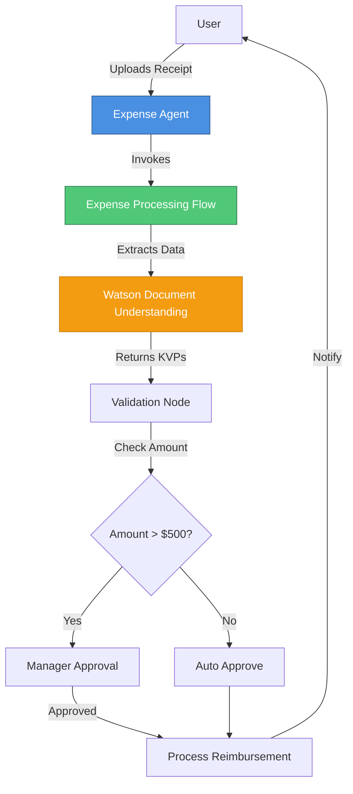

# Lab 5: Use Bob to Build Agentic Flows for Expense Processing

> **📥 Download Lab Guide:** [IBM i User Group - Create wxO Agentic Workflows with Bob.pdf](https://github.ibm.com/Luke-Driver/2ndJuneWxOBob/raw/main/assets/IBM%20i%20User%20Group%20-%20Create%20wxO%20Agentic%20Workflows%20with%20Bob.pdf)

## 📋 Overview

**Duration:** ~90 minutes  
**Level:** Intermediate to Advanced  
**Prerequisites:** Completion of Lab 3, Python programming knowledge

In this lab, you'll build complex agentic workflows programmatically using Bob and the watsonx Orchestrate ADK. You'll create an expense report processing system that includes document extraction, validation, and approval workflows.

---

## 🎯 Learning Objectives

By the end of this lab, you will be able to:

1. Create flows programmatically using Python and the ADK
2. Implement document processing workflows with Watson Document Understanding
3. Build multi-step approval processes
4. Use flow nodes (tool, LLM, docproc, user activity, conditions)
5. Map data between flow nodes
6. Test flows programmatically with Python
7. Deploy flows to watsonx Orchestrate
8. Integrate flows with agents

---

## 📚 Lab Materials

### Primary Reference Document

**📄 Complete Lab Guide:** `../assets/IBM i User Group - Create wxO Agentic Workflows with Bob.pdf`

This comprehensive PDF contains:
- Detailed step-by-step instructions
- Code examples and templates
- Screenshots and diagrams
- Troubleshooting guidance
- Best practices

**Please open and follow the PDF for complete lab instructions.**

---

## 🚀 Lab Overview

### What You'll Build

An **Expense Report Processing System** that can:
- Accept expense report documents (receipts, invoices)
- Extract structured data using Watson Document Understanding
- Validate expenses against company policy
- Route for approval based on amount
- Process reimbursements
- Send notifications

### Architecture Diagram



---

## 🛠️ Prerequisites

Before starting this lab, ensure you have:

### 1. Development Environment
- ✅ Python 3.9 or higher
- ✅ VS Code with IBM Bob extension
- ✅ watsonx Orchestrate ADK installed
- ✅ Git for version control

### 2. watsonx Services
- ✅ watsonx Orchestrate instance
- ✅ Watson Document Understanding access
- ✅ Environment activated

### 3. Knowledge from Previous Labs
- ✅ Lab 3 completed (agent creation with Bob)
- ✅ Understanding of Python basics
- ✅ Familiarity with Pydantic models

### 4. Setup Verification
```bash
# Verify ADK installation
orchestrate --version

# Check environment
orchestrate env list
orchestrate env activate local

# Verify Python
python --version

# Check Bob extension
# Open VS Code and verify Bob is active
```

---

## 📖 Key Concepts

### 1. Document Processing Flow Pattern

```python
from ibm_watsonx_orchestrate.flow_builder.flows import Flow, flow, START, END
from ibm_watsonx_orchestrate.flow_builder.nodes import DocProcOutputFormat

@flow(
    name="expense_processing",
    display_name="Expense Report Processing",
    description="Extract and process expense data from receipts",
    input_schema=ExpenseInput
)
def build_expense_flow(aflow: Flow) -> Flow:
    # 1. Get KVP schema for extraction
    schema_node = aflow.tool(get_expense_schema)
    
    # 2. Process document
    doc_node = aflow.docproc(
        name="extract_expense",
        task="text_extraction",
        document_structure=True,
        enable_hw=True,
        output_format=DocProcOutputFormat.object
    )
    doc_node.map_input(
        input_variable="kvp_schemas",
        expression="flow.schema_node.output"
    )
    
    # 3. Validate extracted data
    validate_node = aflow.tool(validate_expense)
    
    # 4. Conditional approval
    # ... (see PDF for complete implementation)
    
    aflow.sequence(START, schema_node, doc_node, validate_node, END)
    return aflow
```

### 2. KVP Schema Definition

```python
@tool(permission=ToolPermission.READ_ONLY)
def get_expense_schema(placeholder: str) -> list:
    """Define fields to extract from expense documents"""
    return [{
        "document_type": "expense_receipt",
        "fields": {
            "merchant_name": {
                "description": "Name of merchant/vendor",
                "example": "Acme Office Supplies"
            },
            "total_amount": {
                "description": "Total expense amount",
                "example": "125.50"
            },
            "date": {
                "description": "Transaction date",
                "example": "2024-01-15"
            },
            "category": {
                "description": "Expense category",
                "example": "Office Supplies"
            }
        }
    }]
```

### 3. Flow Testing

```python
# main.py
import asyncio
from pathlib import Path
from tools.expense_flow import build_expense_flow

async def main():
    # Compile and deploy flow
    flow_def = await build_expense_flow().compile_deploy()
    
    # Save flow specification
    generated_folder = f"{Path(__file__).resolve().parent}/generated"
    flow_def.dump_spec(f"{generated_folder}/expense_flow.json")
    
    # Test flow with sample data
    result = await flow_def.invoke({
        "document_path": "sample_receipt.pdf"
    }, debug=True)
    
    print("Flow Result:", result)

if __name__ == "__main__":
    asyncio.run(main())
```

---

## 🎨 Project Structure

```
lab-5-bob-expense-flows/
├── README.md                          # This file
├── main.py                            # Flow testing script
├── import-all.sh                      # Import script
├── tools/                             # Tool implementations
│   ├── __init__.py
│   ├── expense_schema.py             # KVP schema definition
│   ├── expense_flow.py               # Main flow definition
│   ├── validate_expense.py           # Validation tool
│   └── process_reimbursement.py      # Processing tool
├── agents/                            # Agent configurations
│   └── expense_agent.yaml            # Expense processing agent
├── generated/                         # Generated artifacts
│   └── expense_flow.json             # Compiled flow spec
└── examples/                          # Sample documents
    ├── sample_receipt.pdf
    └── sample_invoice.pdf
```

---

## 🚀 Quick Start Guide

### Step 1: Review the PDF
Open and read: `../assets/IBM i User Group - Create wxO Agentic Workflows with Bob.pdf`

### Step 2: Set Up Project
```bash
# Create project directory
mkdir -p lab-5-bob-expense-flows/{tools,agents,generated,examples}
cd lab-5-bob-expense-flows

# Initialize Python package
touch tools/__init__.py
```

### Step 3: Use Bob to Generate Code
1. Open VS Code in the project directory
2. Use Bob to generate:
   - KVP schema tool
   - Document processing flow
   - Validation tools
   - Agent configuration

### Step 4: Implement the Flow
Follow the PDF instructions to:
1. Create KVP schema tool
2. Build document processing flow
3. Add validation logic
4. Implement conditional approval
5. Add notification steps

### Step 5: Test Programmatically
```bash
# Set PYTHONPATH
export PYTHONPATH=/path/to/adk/src:/path/to/adk

# Run test
python main.py
```

### Step 6: Import to watsonx Orchestrate
```bash
# Make import script executable
chmod +x import-all.sh

# Import tools and flows
./import-all.sh

# Verify import
orchestrate tools list
orchestrate agents list
```

### Step 7: Test End-to-End
```bash
# Start chat
orchestrate chat start

# Select expense agent
# Upload a receipt
# Verify processing
```

---

## 💡 Advanced Patterns

### Pattern 1: Multi-Document Processing
```python
# Process multiple receipts in a batch
foreach_node = aflow.foreach(
    collection="flow.input.documents",
    item_name="document"
)
# Process each document
```

### Pattern 2: Approval Routing
```python
# Route based on amount and category
condition_node = aflow.condition(
    expression="flow.validate_node.output.amount > 500"
)
# Different approval paths
```

### Pattern 3: Error Handling
```python
# Handle extraction failures
try_node = aflow.try_catch(
    try_nodes=[doc_node, validate_node],
    catch_nodes=[error_handler]
)
```

### Pattern 4: Parallel Processing
```python
# Process validation and approval lookup in parallel
parallel_node = aflow.parallel([
    validate_expense,
    lookup_approver
])
```

---

## 🔍 Common Scenarios

### Scenario 1: Simple Receipt Processing
- Upload receipt image
- Extract merchant, amount, date
- Auto-approve if under limit
- Process reimbursement

### Scenario 2: Invoice with Line Items
- Upload multi-page invoice
- Extract header and line items
- Validate against PO
- Route for approval

### Scenario 3: Mileage Reimbursement
- Collect trip details
- Calculate mileage
- Apply rate
- Process payment

### Scenario 4: Per Diem Expenses
- Collect travel dates
- Calculate per diem
- Validate against policy
- Approve and process

---

## 🐛 Troubleshooting

### Document Processing Issues

**Issue:** Document extraction fails
```python
# Solution: Check document format and quality
# Ensure PDF is readable
# Try with different document
```

**Issue:** KVP fields not extracted
```python
# Solution: Refine KVP schema
# Add more examples
# Improve field descriptions
```

### Flow Execution Issues

**Issue:** Flow compilation fails
```bash
# Solution: Check Python syntax
python -m py_compile tools/expense_flow.py

# Verify imports
# Check Pydantic models
```

**Issue:** Node mapping errors
```python
# Solution: Verify data mapping
# Check variable names
# Ensure output format matches input
```

### Integration Issues

**Issue:** Agent can't invoke flow
```yaml
# Solution: Verify flow is imported
orchestrate tools list | grep expense

# Check agent YAML includes flow
tools:
  - expense_processing
```

---

## ✅ Lab Completion Checklist

- [ ] Reviewed complete PDF guide
- [ ] Set up project structure
- [ ] Created KVP schema tool
- [ ] Built document processing flow
- [ ] Implemented validation logic
- [ ] Added conditional approval
- [ ] Tested flow programmatically
- [ ] Imported to watsonx Orchestrate
- [ ] Created expense agent
- [ ] Tested end-to-end with sample documents
- [ ] Documented flow design

---

## 🎓 What's Next?

After completing this lab, proceed to:

**[Lab 6: Use Bob to Build Custom Tools](../lab-5-bob-custom-tools/)**

In Lab 5, you'll learn to:
- Create reusable Python tools
- Implement tool best practices
- Build a tool library
- Share tools across agents

---

## 📚 Additional Resources

### Official Documentation
- [ADK Flow Builder Documentation](https://github.com/IBM/ibm-watsonx-orchestrate-adk/blob/main/docs/flows.md)
- [Watson Document Understanding](https://www.ibm.com/docs/en/watson-libraries)
- [Document Processing Examples](https://github.com/IBM/ibm-watsonx-orchestrate-adk/tree/main/examples/flow_builder)

### Related Examples in ADK
- `examples/flow_builder/document_processing/`
- `examples/flow_builder/document_classifier/`
- `examples/flow_builder/document_extractor/`

### Reference Materials
- **Setup Guide:** `../assets/IBM i User Group - WxO Bob Setup.pptx`
- **Complete Lab:** `../assets/IBM i User Group - Create wxO Agentic Workflows with Bob.pdf`

---

## 🤝 Credits

**Original Workshop:** IBM i User Group  
**Document:** "Create wxO Agentic Workflows with Bob"  
**Authors:** IBM watsonx Orchestrate Team

This lab guide serves as a companion to the comprehensive PDF workshop materials.

---

## 📧 Support

**For Lab Materials:**
- Review the PDF in `../assets/`
- Check the [main README](../README.md)
- Consult ADK documentation

**For Technical Issues:**
- Check ADK examples
- Review Watson Document Understanding docs
- Contact watsonx support

---

**Ready to build powerful document processing flows? Let's get started! 🚀**

**Remember:** The complete step-by-step instructions with code examples are in the PDF guide in the assets folder!